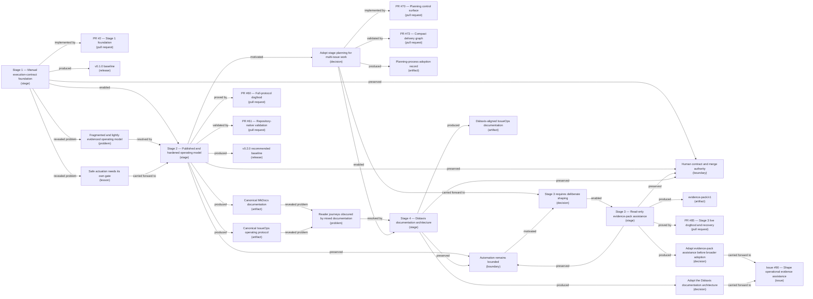

# IssueOps delivery graph

Generated from `planning/delivery/delivery.yaml`. Do not edit this file directly.

```mermaid
flowchart LR
  n_stage_1["Stage 1 — Manual execution-contract foundation\n(stage)"]
  n_pr_2["PR #2 — Stage 1 foundation\n(pull request)"]
  n_release_v0_1["v0.1.0 baseline\n(release)"]
  n_lesson_safe_operation["Safe actuation needs its own gate\n(lesson)"]
  n_problem_fragmented_model["Fragmented and lightly evidenced operating model\n(problem)"]
  n_stage_2["Stage 2 — Published and hardened operating model\n(stage)"]
  n_artifact_docs_site["Canonical MkDocs documentation\n(artifact)"]
  n_artifact_operating_protocol["Canonical IssueOps operating protocol\n(artifact)"]
  n_pr_60["PR #60 — Full-protocol dogfood\n(pull request)"]
  n_pr_61["PR #61 — Repository-native validation\n(pull request)"]
  n_release_v0_2["v0.2.0 recommended baseline\n(release)"]
  n_boundary_human_authority["Human contract and merge authority\n(boundary)"]
  n_boundary_bounded_automation["Automation remains bounded\n(boundary)"]
  n_decision_planning_adoption["Adopt stage planning for multi-issue work\n(decision)"]
  n_pr_70["PR #70 — Planning control surface\n(pull request)"]
  n_pr_73["PR #73 — Compact delivery graph\n(pull request)"]
  n_artifact_adoption_record["Planning-process adoption record\n(artifact)"]
  n_decision_stage_3["Stage 3 requires deliberate shaping\n(decision)"]
  n_stage_3["Stage 3 — Read-only evidence-pack assistance\n(stage)"]
  n_artifact_evidence_pack_v1["evidence-pack/v1\n(artifact)"]
  n_pr_85["PR #85 — Stage 3 live dogfood and recovery\n(pull request)"]
  n_decision_adapt_evidence_assistance["Adapt evidence-pack assistance before broader adoption\n(decision)"]
  n_problem_mixed_documentation["Reader journeys obscured by mixed documentation\n(problem)"]
  n_stage_4["Stage 4 — Diátaxis documentation architecture\n(stage)"]
  n_artifact_diataxis_docs["Diátaxis-aligned IssueOps documentation\n(artifact)"]
  n_decision_adopt_diataxis["Adopt the Diátaxis documentation architecture\n(decision)"]
  n_issue_90["Issue #90 — Shape operational evidence assistance\n(issue)"]

  n_stage_1 -->|implemented by| n_pr_2
  n_stage_1 -->|produced| n_release_v0_1
  n_stage_1 -->|revealed problem| n_lesson_safe_operation
  n_stage_1 -->|revealed problem| n_problem_fragmented_model
  n_stage_1 -->|enabled| n_stage_2
  n_problem_fragmented_model -->|resolved by| n_stage_2
  n_lesson_safe_operation -->|carried forward to| n_stage_2
  n_stage_2 -->|produced| n_artifact_docs_site
  n_stage_2 -->|produced| n_artifact_operating_protocol
  n_stage_2 -->|proved by| n_pr_60
  n_stage_2 -->|validated by| n_pr_61
  n_stage_2 -->|produced| n_release_v0_2
  n_stage_1 -->|preserved| n_boundary_human_authority
  n_stage_2 -->|preserved| n_boundary_human_authority
  n_stage_2 -->|preserved| n_boundary_bounded_automation
  n_stage_2 -->|motivated| n_decision_planning_adoption
  n_decision_planning_adoption -->|implemented by| n_pr_70
  n_decision_planning_adoption -->|validated by| n_pr_73
  n_decision_planning_adoption -->|produced| n_artifact_adoption_record
  n_decision_planning_adoption -->|carried forward to| n_decision_stage_3
  n_boundary_bounded_automation -->|motivated| n_decision_stage_3
  n_decision_stage_3 -->|enabled| n_stage_3
  n_stage_3 -->|produced| n_artifact_evidence_pack_v1
  n_stage_3 -->|proved by| n_pr_85
  n_stage_3 -->|preserved| n_boundary_human_authority
  n_stage_3 -->|preserved| n_boundary_bounded_automation
  n_stage_3 -->|produced| n_decision_adapt_evidence_assistance
  n_artifact_docs_site -->|revealed problem| n_problem_mixed_documentation
  n_artifact_operating_protocol -->|revealed problem| n_problem_mixed_documentation
  n_problem_mixed_documentation -->|resolved by| n_stage_4
  n_decision_planning_adoption -->|enabled| n_stage_4
  n_stage_4 -->|produced| n_artifact_diataxis_docs
  n_stage_4 -->|preserved| n_boundary_human_authority
  n_stage_4 -->|preserved| n_boundary_bounded_automation
  n_stage_4 -->|produced| n_decision_adopt_diataxis
  n_decision_adapt_evidence_assistance -->|carried forward to| n_issue_90
  n_decision_adopt_diataxis -->|carried forward to| n_issue_90
```
